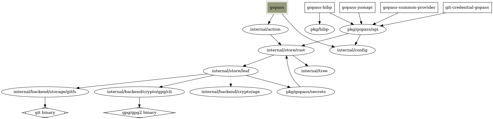

# Architecture

This document describes the high-level architecture of gopass. If you want to
get familiar with the code base you are in the right place.

## Overview

On the highest level gopass manages directories (called `stores` or `mounts`)
that contain (mostly) GPG encrypted text files. gopass transparently handles
encryption and decryption when accessing these files. It applies some heuristics
to parse the file content and support certain operations on that content.

`gopass` is licensed under the terms of the MIT license and we require
compatible licenses from our dependencies as well (when we link against them).

For licensing reasons and security considerations we try to keep the number of
external dependencies (libraries) well-arranged. Try to avoid adding new
dependencies unless absolutely necessary.

## Generalized control flow

This flow chart shows a high level control flow common to most operations.
It leaves out a lot of details but should give a better understanding how
information flows within the program and where changes might be necessary.

## Code Map

This section talks briefly about the various directories and some data
structures.

We're trying to clearly separate between our public API and implementation
details. To that extent we're in the process of moving packages to `internal/`
(and sometimes back to `pkg/`, if necessary).

A note on semantic versioning: `gopass` is both an CLI and an API (Go module).
The expectations around semantic versioning and Go modules make it difficult
to express both concerns in the same versioning scheme, e.g. does a breaking
change in the API require a major version bump even if nothing about the tool
(CLI) has changed? What about the other way round? Thus we have decided to
apply semantic versioning only to the CLI tool, not the Go module. This is not
ideal and might change with sufficient active contributors.

### `docs/backends`

This folder contains documentation about each of our supported backends. See
`internal/backend` below for more information about our backend design.

### `docs/commands`

This folder contains the specification of each sub command the tool offers.
We have many sub commands with sometimes dozens of flags each. In the past we
did encounter some inconsistencies and decided to introduce specifications for
each command. If the specification and the implementation disagree this should
be reported as a bug and fixed or the specification needs to be changed (but the
general assumptions should be that the specification is correct, not the code).

### `docs/usecases`

This directory contains an (incomplete) list of our core use cases, i.e. the
critical user journeys we aim to support. `gopass` can be used in various ways
and try to remain flexible and extensible, but if we encounter a conflict
between a blessed use case and a corner case we prefer the former.

### `helpers/`

This directory contains some release automation tooling that is supposed to be
invoked with `go run`. The changelog generator in `helpers/changelog` is used
by our GitHub Action based release automation and shouldn't be invoked manually.

The tooling in `helpers/release` will prepare a new release and helps to file a
release pull request will all the required updates in place.

### `internal/` and `pkg/`

`gopass` used to not have either of these and all our packages were rooted
directly in the repository. However we began to notice that other projects
were starting to depend directly on our internal packages and we sometimes
broke them. This put us and the other project into an unpleasant
situation so we tried to clarify the expectations by using Go's `internal/`
visibility rule to keep other projects from depending on our implementation
details.

Note: If we have a good reasons to use one of our `internal/` packages either
copy it (our license should rarely be an issue) or nicely ask us and explain
why something should move to `pkg/`.

As we are in the process of formalizing a proper API surface we sometimes need
to move packages from `internal/` to `pkg/`. The other direction might also
occur, but much less often.

### `internal/action`

This directory contains one file, and sometimes sub folders, for each command
`gopass` supports. These are mostly self-contained, but some (e.g. show / edit
/ find) need to depend on each other.

TODO: There is a lot to be said about this package, e.g. custom errors.

### `internal/backend`

`gopass` is built around the concept of multiple independent password stores
that can be mounted into one namespace, much like regular file systems. Each
of these stores can have a different storage and crypto backend. We used to
have independent revision control backends as well, but since the RCS (e.g.
git) interacts so closely with the storage (you can't use regular git w/o a
filesystem-based storage) we have merged storage and RCS backends.

The backend package defines the interfaces for the backend implementation
and provides a registry that returns the concrete backend from the list of
registered ones. Registration happens through blank imports of either the
`internal/backend/crypto` and `internal/backend/storage` packages.

Each backend needs to have a loader implementation in its `loader.go` (please
stick to this name). We try to auto-detect the most applicable backend when
initializing the process, but some backends look alike (e.g. a `fs` and an 
uninitialized `gitfs`). So the loader comes with a priority which is respected
during lookup.

### `internal/config`

The `config` package implements support for a simple YAML-based configuration
format for `gopass`. Most of the code in this package is for backwards
compatibility. Whenever we introduce or remove a config option we need to
introduce a new fallback version that is automatically attempted when loading
a config file. To resolve ambiguities when parsing different config versions
we use a "catch-all" field to catch any unused keys and check that this is
empty after parsing - otherwise we need to try a different config version.

NOTE: We did support nested configurations for sub-stores but removed this
because the maintenance cost did not justify the benefits of this feature.

### `internal/cui`

The name `cui` is an abbreviation for `console-user-interface` and contains
several helper functions to interact with humans over a text based interface.

Most of these ask the user to select some item from a selection or provide
some input.

NOTE: We used to support rich terminal UIs with arrow navigation and such.
However all existing libraries that were available without CGO were either
abandoned or buggy on some platforms and we didn't have any capacity to fix
them. So we had to remove support for this feature.

### `internal/queue`

The `queue` package implements a FIFO queue that executes
in the background. This allows for certain operations, like a git push, to be
taken out of the critical path wrt. user interactions. The queue will be fully
processed before the process exits.

### `internal/store/root`

The `root store` package implements an internal password store API that (only)
supports mounting `leaf` stores. It will forward (almost) all operations to
its `leaf` stores (moves across stores being a notable exception) and do the
necessary manipulations of the affected path components (e.g. removing/adding
the mount prefix from the secret name as needed).

This package makes `gopass` multi-store capable.

### `internal/store/leaf`

The `leaf store` package implements a password store that is mostly compatible
with any other password store implementation (while aiming for interoperability,
not at 100% feature parity). The low-level operations like filesystem and / or
version control and crypto operations are passed to the configured `storage`
or `crypto` backend.

### `internal/tree`

The `tree` package implements a simple tree structure that prints an output
similar to the output of the Unix tool `tree`. It does support different
`gopass` specific properties (like mounts or templates) not easily implemented
with other tree packages.

### `internal/updater`

The `updater` package implements a secure and anonymous self updater.

Note: The self updater contacts GitHub. If this is a concern one should use
other sources, e.g. distro packages.

It retrieves the latest stable release from GitHub, fetches its metadata
and verifies the signature against the built-in release signing keyring.

It tries to avoid conflicting with any `gopass` binary managed by the OS
and refuse to update these.

### `pkg/`

The package `pkg/` contains our public API surface, i.e. packages we want or
have to expose externally. Some packages (e.g. `otp`) are only exposed because
they are being used by some of our integrations. Others (e.g. `pinentry` or
`pwgen`) are designed for wider use. We are considering to split some of the
more widely used packages into their own repositories to work better with
Go module and semantic versioning expectations.

#### `pkg/appdir`

The `appdir` package contains a set of [XDG Base Directory Specification](https://specifications.freedesktop.org/basedir-spec/basedir-spec-latest.html)
compatible implementations with some `gopass` specifics. For testing purposes
we want to honor the setting of `GOPASS_HOMEDIR` before everything else, so our
implementation has to take this into account before following the XDG spec.

#### `pkg/clipboard`

The `clipboard` package is a wrapper around a clipboard package that adds
support for clearing the clipboard.

#### `pkg/ctxutil`

The `ctxutil` is the pragmatic (read: non-idiomatic) approach to pass very
specific configuration options through multiple layers of abstraction. This is
arguably not the best design, but it works well and avoids bloated interfaces.

#### `pkg/gopass`

This package contains **the** gopass API interface. We provide a concrete
implementation that should work with any properly initialized gopass setup
and a mock for tests.

This package is designed as the main entry point for any integration that wants
to integrate with gopass.

### `tests`

`gopass` comes with a comprehensive set of integration tests, i.e. tests that
are executed by running a newly compiled gopass binary without access to any
kind of internal state. These tests can't be as exhaustive as the unit tests
but they exist to ensure basic functionality aren't broken by a change.

