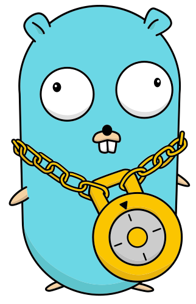

<p align="center">
    
</p>

# gopass

[](https://travis-ci.org/justwatchcom/gopass)
[](https://goreportcard.com/report/github.com/justwatchcom/gopass)
[](https://codeclimate.com/github/justwatchcom/gopass)

The slightly more awesome Standard Unix Password Manager for Teams. Written in Go.

> Password management should be simple and follow [Unix philosophy](http://en.wikipedia.org/wiki/Unix_philosophy). With `pass`, each secret lives inside of a `gpg` encrypted file whose filename is the title of the website or resource that requires the secret. These encrypted files may be organized into meaningful folder hierarchies, copied from computer to computer, and, in general, manipulated using standard command line file management utilities. - [passwordstore.org](https://www.passwordstore.org/)

Our target audience are professional developers and sysadmins (and especially teams of those) who are well versed with a
command line interface. One explicit goal for this project is to make it more approachable to semi- and non-technical users
in the long term as well. We go by the UNIX philosophy and try to do one thing and do it well - always providing stellar
user experience and sane, simple interfaces.

Warning: _gopass_ currently works on Linux & macOS. Please feel free to help with others.

## Demo

[](https://asciinema.org/a/101688)

## Standard Features

### Setup of a Store

If you don't have an existing password store or your store is completely empty you have to initialize it.

Please note: This document uses the term *password store* to refer to a directory (usually `$HOME/.password-store`) which is managed by either `gopass` or `pass`. This is entirely different from any OS-level credential store, your GPG Keyring or your SSH Keys.

Choose one of:
```bash
$ gopass init gopher@golang.org
$ gopass init A3683834
$ gopass init 1E52C1335AC1F4F4FE02F62AB5B44266A3683834    # prefered
```

This will encrypt any secret which is added to the store for the recipient.

#### Clone an existing store

If you already have a _password-store_ that you would clone to the system you can take one short cut:

```bash
$ gopass clone git@example.com/pass.git
$ gopass clone git@example.com/pass-work.git work # clone as mount called: work
```

This runs `git clone` in the background and also sets up the `.gopass.yml` if necessary.

A second parameter tells gopass to clone and mount it to the store.
In the example above the repository would have been cloned to `$HOME/.password-store-work`.
Afterwards the directory would have been mounted as `work`.

Please note that the repository must contain an already initialized password
store. You can initialize a new store with `gopass init --path /path/to/store`.

### Adding secrets

Let's say you want to create an account.

| Website    | User   |
| ---------- | ------ |
| golang.org | gopher |


#### Type in a new secret

```bash
$ gopass insert golang.org/gopher
Enter secret for golang.org/gopher:       # hidden
Retype secret for golang.org/gopher:      # hidden
gopass: Encrypting golang.org/gopher for these recipients:
 - 0xB5B44266A3683834 - Gopher <gopher@golang.org>

Do you want to continue? [yn]: y
```

#### Generate a new secret

```bash
$ gopass generate golang.org/gopher
How long should the secret be? [20]:
gopass: Encrypting golang.org/gopher for these recipients:
 - 0xB5B44266A3683834 - Gopher <gopher@golang.org>

Do you want to continue? [yn]: y
The generated secret for golang.org/gopher is:
Eech4ahRoy2oowi0ohl
```

```bash
$ gopass generate golang.org/gopher 16    # length as paramenter
gopass: Encrypting golang.org/gopher for these recipients:
 - 0xB5B44266A3683834 - Gopher <gopher@golang.org>

Do you want to continue? [yn]: y
The generated password for golang.org/gopher is:
Eech4ahRoy2oowi0ohl

```

The `generate` command will ask for any missing arguments, like name of the secret or the length. If you don't want the password to be displayed use
the `-c` flag to copy it to your clipboard.

### Edit a secret

```bash
$ gopass edit golang.org/gopher
```

The `edit` command uses the `$EDITOR` environment variable to start your preferred editor where
you can easily edit multi-line content. `vim` will be the default if `$EDITOR` is not set.

### Listing existing secrets

You can list all entries of the store:

```bash
$ gopass
gopass
├── golang.org
│   └── gopher
└── emails
    ├── user@example.com
    └── user@justwatch.com
```

If your terminal supports colors the output will use ANSI color codes to highlight directories
and mounted sub stores. Mounted sub stores include the mount point and source directory. See
below for more details on mounts and sub stores.

### Show a secret

```bash
$ gopass golang.org/gopher

Eech4ahRoy2oowi0ohl
```

The default action of `gopass` is show. It also accepts the `-c` flag to copy the content of
the secret directly to the clipboard.

Since it may be dangerous to always display the password on `gopass` calls, the `safecontent`
setting may be set to `true` to allow one to display only the rest of the password entries by
default and display the whole entry, with password, only when the `-f` flag is used.

#### Copy secret to clipboard

```bash
$ gopass -c golang.org/gopher

Copied golang.org/gopher to clipboard. Will clear in 45 seconds.
```

### Removing secret

```bash
$ gopass rm golang.org/gopher
```

`rm` will remove a secret from the store. Use `-r` to delete a whole folder.
Please note that you **can not** remove a folder containing a mounted sub store.
You have to unmount any mounted sub stores first.

### Moving secrets

```bash
$ gopass mv emails/example.com emails/user@example.com
```

*Moving also works across different sub-stores.*

### Copying secrets

```bash
$ gopass cp emails/example.com emails/user@example.com
```

*Copying also works across different sub-stores.*

## Advanced Features

### Auto-Pager

Like other popular open-source projects `gopass` automatically pipe the output
to `$PAGER` if it's longer than one terminal page. You can disable this behaviour
by unsetting `$PAGER` or `gopass config nopager true`.

### git auto-push and auto-pull

If you want gopass to always push changes in git to your default remote (origin)
enable autopush:

```bash
$ gopass config autopush true
```

We also support `pull before push` to reduce the change of `rejected` pushes when frequent commits to a repo are made.

```bash
$ gopass config autopull true
```

### Check Passwords for Common Flaws

gopass can check your passwords for common flaws, like being too short or coming
from a dictionary.

```bash
$ gopass audit
Detected weak secret for 'golang.org/gopher': Password is too short
```

### Check Passwords against leaked passwords

gopass can assist you in checking your passwords against those included in recent
data breaches. Right now this you still need to download and unpack those dumps
yourself, but gopass can take care of the rest.

First go to (haveibeenpwned.com/Passwords)[https://haveibeenpwned.com/Passwords] and download
the dumps. Then unpack the 7-zip archives somewhere. Note that full path to those
files and provide it to gopass in the environment variable `HIBP_DUMPS`.

```bash
$ HIBP_DUMPS=/tmp/pwned-passwords-1.0.txt gopass audit hibp
```

### Support for Binary Content

gopass provides secure and easy support for working with binary files through the
`gopass binary` family of subcommands. One can copy or move secret from or to
the store. gopass will attempt to securely overwrite and remove any secret moved
to the store.

```bash
# copy file "/some/file.jpg" to "some/secret.b64" in the store
$ gopass binary cp /some/file.jpg some/secret
# move file "/home/user/private.key" to "my/private.key.b64", removing the file on disk
# after the file has been encoded, stored and verified to be intact (SHA256)
$ gopass binary mv /home/user/private.key my/private.key
# Calculate the checksum of some asset
$ gopass binary sha256 my/private.key
```

### Multiple Stores

gopass supports multi-stores that can be mounted over each other like filesystems
on Linux/UNIX systems.

To add an mount point to an existing store add an entry to the `mounts` object
of the store.

gopass tries to read its configuration from `$HOME/.config/gopass/config.yml` if present.
You can override this location by setting `GOPASS_CONFIG` to another location.

Mounting new stores can be done through gopass:

```bash
# Mount a new store
$ gopass mounts add test /tmp/password-store-test
# Show mounted stores
$ gopass mounts
# Umount a store
$ gopass mounts remove test
```

You can initialize a new store using `gopass init --store mount-point --path /path/to/store`.

Where possible sub stores are supported transparently through the path to the
secret. When specifying the name of a secret it's matched against any mounted
sub stores and the given action is executed on this store.

Commands that don't accept an secret name, e.g. `gopass recipients add` or
`gopass init` usually accept a `--store` parameter. Please check the help output
of each command for more information, e.g. `gopass help init` or
`gopass recipients help add`.

Commands that support the `--store` flag:

| **Command** | *Example* | Description |
| ----------- | --------- | ----------- |
| `gopass git` | `gopass git --store=foo push origin master` | Push all changes in the sub store *foo* to master
| `gopass git init` | `gopass git init --store=foo` | Initialize git in the sub store *foo*
| `gopass init` | `gopass init --store=foo` | Initialize and mount the new sub store *foo*
| `gopass recipients add`| `gopass recipients add --store=foo GPGxID` | Add the new recipient *GPGxID* to the store *foo*
| `gopass recipients remove` | `gopass recipients remove --store=foo GPGxID` | Remove the existing recipients *GPGxID* from the store *foo*

### Directly edit structured secrets aka. YAML support

`gopass` supports directly editing structured secrets (only simple key-value maps so far).

```bash
$ gopass generate -n foo/bar 12
The generated password for foo/bar is:
7fXGKeaZgzty
$ gopass insert foo/bar baz
Enter password for foo/bar/baz:
Retype password for foo/bar/baz:
$ gopass foo/bar baz
zab
$ gopass foo/bar
7fXGKeaZgzty
baz: zab
```

### Edit the Config

`gopass` allows editing the config from the commandline. This is similar to how `git` handles `config`
changes through the commandline. Any change will be written to the configured `gopass` config file.

```bash
$ gopass config
alwaystrust: false
askformore: false
autoimport: false
autopull: false
autopush: true
cliptimeout: 10
loadkeys: false
noconfirm: false
path: /home/user/.password-store
persistkeys: false

$ gopass config cliptimeout 60
$ gopass config cliptimeout
```

### Managing Recipients

You can list, add and remove recipients from the commandline.

```bash
$ gopass recipients
gopass
└── 0xB5B44266A3683834 - Gopher <gopher@golang.org>

$ gopass recipients add 1ABB2C1A

$ gopass recipients
gopass
├── 0xB1C7DF661ABB2C1A - Someone <someone@example.com>
└── 0xB5B44266A3683834 - Gopher <gopher@golang.org>

$ gopass recipients remove 0xB5B44266A3683834

$ gopass recipients
gopass
└── 0xB1C7DF661ABB2C1A - Someone <someone@example.com>
```

Running `gopass recipients` will also try to load and save any missing GPG keys
from and to the store.

The commands manipulating recipients, i.e. `gopass recipients add` and
`gopass recpients remove` accept a `--store` flag that expects the
*name of a mount point* to operate on this mounted sub store.

### Debugging

To debug `gopass`, set the environment variable `GOPASS_DEBUG` to `true`.

### Disabling Colors

Disabling colors is as simple as `gopass config nocolor true`.

### Password Templates

With gopass you can create templates which are searched when executing `gopass edit` on a new secret. If the folder, or any parent folder, contains a file called `.pass-template` it's parsed as a Go template, executed with the name of the new secret and an auto-generated password and loaded into your `$EDITOR`.

This makes it easy to e.g. generate database passwords or use templates for certain kind of secrets.

## Known Limitations and Caveats

### GnuPG

`gopass` uses [gpg](https://www.gnupg.org) to encrypt its secrets. This makes it easy to build a software we feel comfortable
trusting our credentials with, but `gpg` isn't known for being the most user-friendly software.

We try to work around some of the usability limitations of `gpg` but we always have to keep the security
goals in mind, so some features have to trade some usability against security and vice-versa.

### git history and local files

Please keep in mind that by default `gopass` stores its encrypted secrets in git. *This is a deviation
from the behavior of `pass`, which does not force you to use `git`.* Furthermore, the decision has some important
properties.

First it means that every user of `gopass` (and any attacker with access to your git repo) has a local
copy with the full history. If we revoke access to a store from an user and re-encrypt the whole store
this user won't be able to access any changed or added secrets but he'll be always able to access to
secrets by checking out old revisions from the repository.

**If you revoke access from a user you SHOULD change all secrets he had access to!**

### Private Keys required

Please note that we try to make it hard to lock yourself out from your secrets.
To ensure that a user is always able to decrypt his own secrets we require you
to have at least the public **and** private part of an recipient key available.

## Installation

You can either use a package manager, download a pre-built binary or install from source. If you have
a working Go development environment, we recommend building from source.

### Package manager

#### macOS

```bash
$ brew tap justwatchcom/gopass
$ brew install gopass
```

#### Debian and Ubuntu

```bash
$ wget https://www.justwatch.com/gopass/releases/1.2.0/gopass-1.2.0-linux-amd64.deb
$ sudo dpkg -i gopass-1.2.0-linux-amd64.deb
```

### Download

Please visit https://www.justwatch.com/gopass/releases/ for a list of binary releases.

### From Source

To get the latest version of gopass, run `go get`:

    go get -u github.com/justwatchcom/gopass

If `$GOPATH/bin` is in your `$PATH`, you can now run `gopass` from anywhere on your system and use this.

If you like you can link `$GOPATH/bin/gopass` to `pass` somewhere in your `$PATH` to use gopass as a drop-in
replacement of `pass`.

Assuming `$HOME/bin/` exists and is present in your `$PATH`:

```bash
$ ln -s $GOPATH/bin/gopass $HOME/bin/pass
```

### Autocompletion

Run one of the following commands for your shell and you should have
autocompletion for subcommands like `gopass show`, `gopass ls` and others.

    source <(gopass completion bash)
    source <(gopass completion zsh)

### fish completion

Experimental [fish](https://fishshell.com/) shell completion is available.
Copy the file `fish.completion` to `~/.config/fish/completions/gopass.fish`
and start a new shell.

Since writing fish completion scripts is not yet supported by the CLI library we
use, this completion script is missing a few features. Feel free to contribute
if you want to improve it.

### dmenu/rofi support

In earlier versions gopass supported [dmenu](http://tools.suckless.org/dmenu/).
We removed this and encourage you to call dmenu yourself now.

This also makes it easier to call gopass with e.g. [rofi](https://github.com/DaveDavenport/rofi).

```bash
# Simply copy the selected password to the clipboard
$ gopass ls --flat | dmenu | xargs --no-run-if-empty gopass show -c
# First pipe the selected name to gopass, encrypt it and type the password with xdotool.
$ gopass ls --flat | dmenu | xargs --no-run-if-empty gopass show | xdotool type --clearmodifiers --file -
```

### Dependencies

`gopass` needs some external programs to work.

* `gpg`
* `git`

On Debian-based Linux systems you should run this command:

```bash
$ apt-get install gnupg git
```

On macOS with [homebrew](http://brew.sh) the following will do:

```bash
$ brew install gnupg2 git
```

### Setup GPG

`gopass` depends on `gpg` for encryption and decryption. You **must** have a
suitable key pair.

```bash
$ gpg --gen-key
# Key Type: Choose either "RSA and RSA" or "DSA and ElGamal"
# Key Size: Choose at least 2048
# Validity: 5 to 10 years is a good default
# Enter your real name and primary email address, comment is not necessary
# Passphrase: Make sure to pick a very long passphrase, not just a simple password. Remeber this should be stronger than any of the secrets you store in the password store. You can configure the GPG Agent later, to save you repititive typing.
```

There are a lot of good manuals to get started with GPG out there.

We recommend these ones:

* ["git + gpg, know thy commits" at coderwall](https://coderwall.com/p/d3uo3w/git-gpg-know-thy-commits)
* ["Generating a new GPG key" by GitHub](https://help.github.com/articles/generating-a-new-gpg-key/)

### Data Organization

Your data in `gopass` loosely resembles an filesystem. You need to have at least one
root store but you can mount as many sub-stores (think of volumes) under the root volume.

The stores do not impose any specific layout for your data. Any `key` can contain any kind of data.

Please note that sensitive data **should not** be put into the name of a secret.

If you mainly use a store for website logins or plan to use
[browserpass](https://github.com/dannyvankooten/browserpass) you should follow
the following pattern for storing your credentials:

```
example.org/user
example.com/john@doe.com
```

#### Storing and Syncing your Password Store with Google Drive/Dropbox/...

Please be warned that using a cloud-based storage _drive_ may negatively impact
to confidentially of your store, but if you wish to use one of these services
you can do so.

For example, if using [Google Drive](https://drive.google.com):

```bash
cd
gopass init --nogit
mv .password-store/ "Google Drive/Password-Store"
gopass config path "~/Google Drive/Password-Store"
```

### Using other GUIs with `gopass`

Because `gopass` is fully *backwards* compatible with `pass` you can simply use other existing interfaces.
We use the [Android](https://github.com/zeapo/Android-Password-Store) &
[iOS](https://github.com/davidjb/pass-ios#readme) apps ourselves. But there are more integrations for
[Chrome, Firefox](https://github.com/dannyvankooten/browserpass),
[Windows](https://github.com/mbos/Pass4Win) and many more.

### Migrating to `gopass` from other password stores.

Since `gopass` is fully compatible to `pass` you can use any of the migration
tools available for [`pass`](https://www.passwordstore.org) to import from 1Password, LastPass and many more.

## Development

This project uses github-flow, i.e. create feature branches from master, open an PR against master
and rebase onto master if necessary.

We aim for compatibility with the [latest stable Go Release](https://golang.org/dl/) only.

## Security

This project aims to provide a secure and dependable credential store that can
be used by individuals or teams.

We acknowledge that designing and implementing bullet-proof cryptography is very
hard and try to leverage existing and proven technology instead of rolling
our own implementations.

### Ultimate Goals of Security

* Confidentially - Ensure that only authorized parties can understand the data.
	gopass does only try to protect the content of the secrets.
	Neither their presence nor their names. Care must be taken not to
	disclose any confidential information through the name of the secrets.
* Authentication - Ensure that whoever supplies some secret if an authorized party.
	gopass fully relies on GnuPG in this regard.
* Integrity - Ensure that only authorized parties are allowed to modify data.
	Currently gopass makes no attempt at protecting the integrity of a store.
	However we plan to do this in the future.
* Nonrepudiation - Ensure that the involved parties actually transmitted and
	received messages. gopass makes not attempt to ensure this.

### Additional Usability Goals

* Availability - Secrets must always be readable by exactly the specified recipients.
* Sensible Defaults - This project shall try to make the right things easy to do and make the wrong things hard to do.

### Password Store Initialization

gopass only uses GPG for encrypting data. GPG needs to be properly set up before using gopass.
The user is responsible for distributing and importing the necessary public keys. Knowledge
of the web of trust model of GPG is assumed and necessary.

### Generating Passwords

Password generation uses the same approach as the popular tool `pwgen`.
It reads uses the `crypto/rand` to select random characters from the selected
character classes.

### Threat model

The threat model of gopass assumes there are no attackers on your local machine. Currently
no attempts are taken to verify the integrity of the password store. We plan on using
signed git commits for this. Anyone with access to the git repository can see which
secrets are stored inside the store, but not their content.

## Configuration

There are several configuration options available through the command line interface `gopass config`.

| **Option**    | *Type*    | Description |
| ------------- | --------- | ----------- |
| `askformore`  | `bool`    | If enabled - it will ask to add more data after use of `generate` command. |
| `autoimport`  | `bool`    | Import missing keys stored in the pass repo (see `persistkeys`) without asking. |
| `autosync`    | `bool`    | Always do a `git push` after a commit to the store. Makes sure your local changes are always available on your git remote. |
| `cliptimeout` | `int`     | How many seconds the secret is stored when using `-c`. |
| `noconfirm`   | `bool`    | Do not confirm recipient list when encrypting. |
| `path`        | `string`  | Path to the root store. |
| `safecontent` | `bool`    | Only output _safe content_ (i.e. everything but the first line of a secret) to the terminal. Use _copy_ (`-c`) to retrieve the password in the clipboard. |

## Environment Variables

Some configuration options are only available through setting environment variables.

| **Option**    | *Type*    | Description |
| ------------- | --------- | ----------- |
| `CHECKPOINT_DISABLE` | `bool`    | Set to any non-empty value to disable calling the GitHub API when running `gopass version`. |

## API Stability

`gopass` is provided as an CLI program, not as a library. While we try to make the
packages usable as libraries we make no guarantees whatsoever with respect to
the API stability. The `gopass` version only reflects changes in the CLI commands.

If you use `gopass` as a library be sure to vendor it and expect breaking changes.

## Roadmap

- [x] Be 100% pass 1.4 compatible
- [x] Storing binary files in gopass (almost done)
- [x] Storing structured files and templates (credit cards, DBs, websites...)
- [ ] UX improvements and more wizards
- [ ] Tackle the information disclosure issue
- [ ] Build a great workflow for requesting and granting access
- [ ] Better and more fine grained ACL
- [ ] Be nicely usable by semi- and non-technical users

*Note: Being 100% pass compatible was a milestone, not a promise for the future. We will eventually diverge from pass to support more advanced features. This will break compatibility.*

## Further Reading

* [GPGTools](https://gpgtools.org/) for macOS
* [GitHub Help on GPG](https://help.github.com/articles/signing-commits-with-gpg/)
* [Git - the simple guide](http://rogerdudler.github.io/git-guide/)

## FAQ

* *How does gopass relate to HashiCorp vault?* - While [Vault](https://www.vaultproject.io/) is for machines, `gopass` is for humans [#7](https://github.com/justwatchcom/gopass/issues/7)
* `gopass show secret` displays `Error: Failed to decrypt` - This issue may happen if your gpg setup if broken. On MacOS try `brew link --overwrite gnupg`. You also may need to set `export GPG_TTY=$(tty)` in your `.bashrc` [#208](https://github.com/justwatchcom/gopass/issues/208), [#209](https://github.com/justwatchcom/gopass/issues/209)

## Credit & License

`gopass` is maintained by the nice folks from [JustWatch](https://www.justwatch.com/gopass)
and licensed under the terms of the MIT license.

Maintainers of this repository:

* Matthias Loibl <matthias.loibl@justwatch.com> @metalmatze
* Dominik Schulz <dominik.schulz@justwatch.com> @dominikschulz

Please refer to the Git commit log for a complete list of contributors.

## Contributing

We welcome any contributions. Please fork the project on GitHub and open
Pull Requests for any proposed changes.

Please note that we will not merge any changes that encourage insecure
behaviour. If in doubt please open an Issue first to discuss your proposal.
