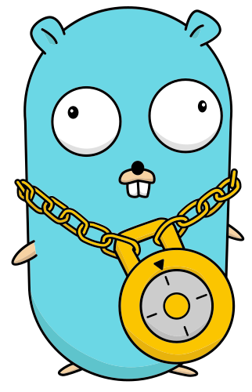
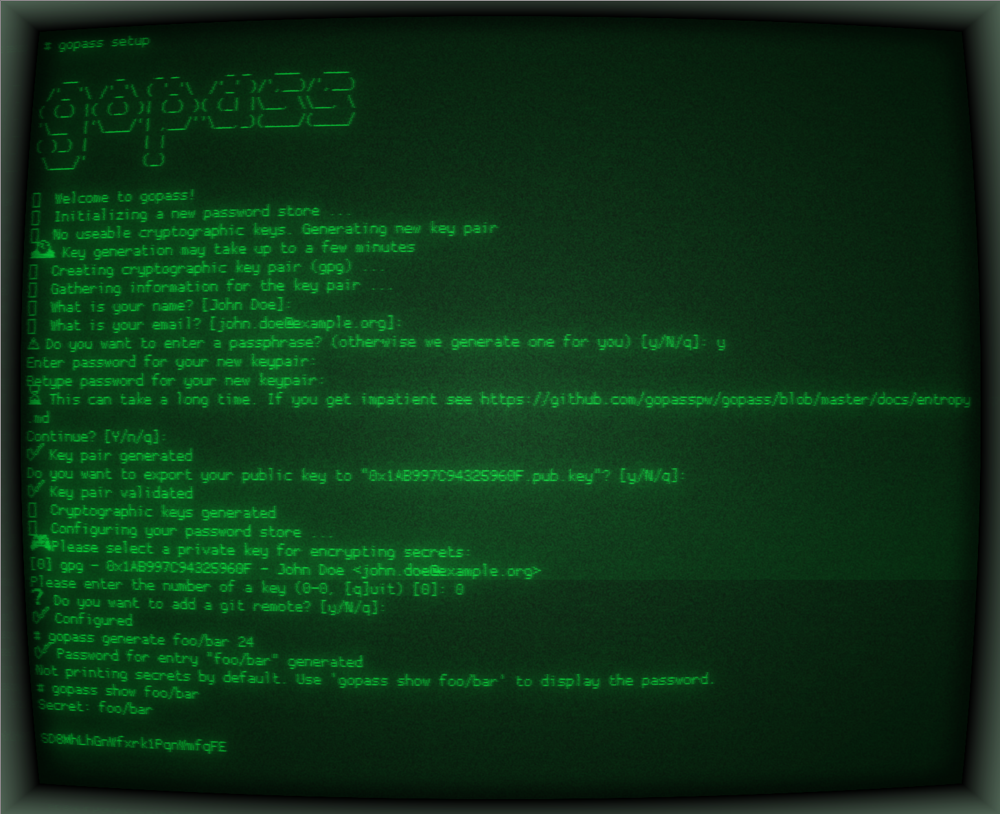

<p align="center">
    
</p>

# Overview [](https://github.com/gopasspw/gopass/actions/workflows/build.yml?query=branch%3Amaster) [](https://repology.org/project/gopass-gopasspw/versions) [](https://github.com/gopasspw/gopass/blob/master/LICENSE) [](https://github.com/gopasspw/gopass/releases) [](https://join.slack.com/t/gopassworkspace/shared_invite/zt-17jl74b5x-U1OUW4ts4AQ7eAf2V4QaaQ)

> The slightly more awesome standard UNIX password manager for teams.

Manage your credentials with ease. In a globally distributed team, on multiple devices or fully offline on an air gapped machine.

- **Works everywhere** - The same user experience on Linux, MacOS, *BSD or Windows
- **Built for teams** - Built from our experience working in distributed development teams
- **Full autonomy** - No network connectivity required, unless you want it

# How Does It Work?

By default your credentials are encrypted with GPG and versioned in git. This can be customized easily.
The primary interface is the command line, making it an excellent choice for CLI fans, CI/CD systems or
anything you can hook it up with. Gopass can also integrate with your browser so you can largely avoid
the command line - if you want.

# Installation

## Necessary prerequisites for running `gopass`

`gopass` can operate without any dependencies but most users will use it with `gpg` and `git`.
An external editor is required to use `gopass edit`.

## Installation through package managers

### [Homebrew](https://brew.sh) (Linux/MacOS)

[](https://github.com/Homebrew/homebrew-core/blob/master/Formula/gopass.rb)

```shell
brew install gopass
```

### Debian (Ubuntu, Debian, Raspbian, ...)

**Warning**: Do not install the `gopass` package for the official repositories. That is a completely different project that has no relation to us.

```shell
curl https://packages.gopass.pw/repos/gopass/gopass-archive-keyring.gpg | sudo tee /usr/share/keyrings/gopass-archive-keyring.gpg >/dev/null
cat << EOF | sudo tee /etc/apt/sources.list.d/gopass.sources
Types: deb
URIs: https://packages.gopass.pw/repos/gopass
Suites: stable
Architectures: all amd64 arm64 armhf
Components: main
Signed-By: /usr/share/keyrings/gopass-archive-keyring.gpg
EOF
sudo apt update
sudo apt install gopass gopass-archive-keyring
```

### Fedora / RedHat / CentOS

[](https://packages.fedoraproject.org/pkgs/gopass/gopass/)

```shell
dnf install gopass
```

Note: You might need to run `dnf copr enable daftaupe/gopass` first.

### Arch Linux

[](https://archlinux.org/packages/extra/x86_64/gopass/)

```shell
pacman -S gopass
```

### Windows

[](https://github.com/ScoopInstaller/Main/blob/master/bucket/gopass.json)

```shell
# WinGet
winget install Git.Git
winget install GnuPG.Gpg4win
winget install gopass.gopass
# Chocolatey
choco install gpg4win
choco install gopass
# Alternatively
scoop install gopass
```

### FreeBSD / OpenBSD

```shell
cd /usr/ports/security/gopass
make install
```

### Alpine Linux

```shell
apk add gopass
```

## Other installation options

Please see [docs/setup.md](https://github.com/gopasspw/gopass/blob/master/docs/setup.md) for other options.

### From Source

```shell
go install github.com/gopasspw/gopass@latest
```

Note: `latest` is not a stable release. We recommend to only use released versions.

### Manual download

Download the [latest release](https://github.com/gopasspw/gopass/releases/latest) and add the binary to your PATH.

# Quick start guide

Initialize a new `gopass` configuration:

```shell
gopass setup

   __     _    _ _      _ _   ___   ___
 /'_ '\ /'_'\ ( '_'\  /'_' )/',__)/',__)
( (_) |( (_) )| (_) )( (_| |\__, \\__, \
'\__  |'\___/'| ,__/''\__,_)(____/(____/
( )_) |       | |
 \___/'       (_)

🌟 Welcome to gopass!
🌟 Initializing a new password store ...
🌟 Configuring your password store ...
🎮 Please select a private key for encrypting secrets:
[0] gpg - 0xFEEDBEEF - John Doe <john.doe@example.org>
Please enter the number of a key (0-12, [q]uit) (q to abort) [0]: 0
❓ Do you want to add a git remote? [y/N/q]: y
Configuring the git remote ...
Please enter the git remote for your shared store []: git@gitlab.example.org:john/passwords.git
✅ Configured
```

By default `gopass setup` will use `gpg` encryption and `git` storage. This will create a new password store in `$HOME/.local/share/gopass/stores/root` and a configuration in `$HOME/.config/gopass/config` using `gpg` encryption and `git` for versioned storage. Users can override these with e.g. `--crypto=age` to use `age` encryption instead or opt out of using a versioned store with `--storage=fs`.

An existing store can be cloned with e.g. `gopass clone git@gitlab.example.org:john/passwords.git`.

Create a new secret:

```shell
gopass create
```

List all existing secrets:

```shell
gopass ls
```

Copy an existing password to the clipboard:

```shell
gopass show -c foo
```

Remove an existing secret:

```shell
gopass rm foo
```

Other examples:

```shell
# Command structure
gopass [<command>] [options] [args]
# Shortcut for gopass show [<key>]
gopass [<key>]

# Enter the gopass REPL
gopass

# Find all entries matching the search string
gopass find github

# List your store
gopass ls

# List all mounts
gopass mounts

# List all recipients
gopass recipients

# Sync with all remotes
gopass sync

# Setup a new store
gopass setup
```

## Screenshot



## Support

Please ask on [Slack](https://join.slack.com/t/gopassworkspace/shared_invite/zt-17jl74b5x-U1OUW4ts4AQ7eAf2V4QaaQ).

## Contributing

We welcome any contributions. Please see [CONTRIBUTING.md](https://github.com/gopasspw/gopass/blob/master/CONTRIBUTING.md) for more information.

## Credit & License

gopass is licensed under the terms of the MIT license. You can find the complete text in [`LICENSE`](https://github.com/gopasspw/gopass/blob/master/LICENSE).

Please refer to our [Contributors](https://github.com/gopasspw/gopass/graphs/contributors) page for a complete list of our contributors.
