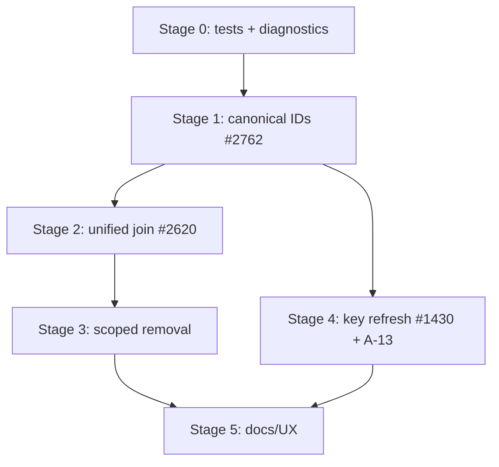

# A-14: Effortless Team Workflows

**Status:** implemented (Stages 0–5 complete, June 2026)
**Sources:**
[#2762](https://github.com/gopasspw/gopass/issues/2762),
[#2620](https://github.com/gopasspw/gopass/issues/2620),
[#1430](https://github.com/gopasspw/gopass/issues/1430)
**Related:** [ADR A-13](A-13-expired-gpg-key-handling.md),
[use cases: team-workflows](../usecases/team-workflows.md)

**Implementation:** branch `fix/issue-1430` (covers all three issues)

---

## 1. Context and problem statement

gopass is widely used by teams, but the team lifecycle (bootstrap a store, join
a team, add/remove members, rotate keys) is fragile. Three long-standing issues
share a common root cause: **recipient identity is not canonical**, and several
code paths handle the gap inconsistently.

The supported workflows are defined in
[docs/usecases/team-workflows.md](../usecases/team-workflows.md). This ADR
analyses the current implementation against those use cases, identifies the
defects, and proposes a staged plan.

### 1.1 How the store represents a team today

* `.gpg-id` — newline-separated recipient IDs (the team).
* `.public-keys/<id>` — armored public key per recipient, **filename is the
  recipient ID verbatim**. Legacy fallback dir: `.gpg-keys/<id>`.
* Global config `recipients.hash.<alias>` — SHA256 of `.gpg-id` for tamper
  detection (only when `recipients.check` is enabled).

### 1.2 Relevant code map (verified)

| Concern | Location |
| --- | --- |
| Recipient set type | `internal/recipients/recipients.go` (`Add` only `TrimSpace`s — no normalization) |
| Init store | `internal/store/leaf/init.go` `Init()` — normalizes via `FindRecipients` → `rs.Add(kl[0])` |
| Add recipient | `internal/store/leaf/recipients.go` `AddRecipient()` — adds **raw** `id` (no normalization) |
| Remove recipient | `internal/store/leaf/recipients.go` `RemoveRecipient()` — 3-level fuzzy match |
| Save recipients | `internal/store/leaf/recipients.go` `saveRecipients()` — writes `.gpg-id`, exports keys if `core.exportkeys`, autopush |
| Export keys | `exportPublicKey()` / `addMissingKeys()` / `UpdateExportedPublicKeys()` — filename = `.public-keys/<r>` |
| Remove extra keys | `removeExtraKeys()` — **disabled by default** (`recipients.remove-extra-keys`, GH-2620) |
| Import keys | `internal/store/leaf/crypto.go` `ImportMissingPublicKeys()`, `recipientCheck()`, `decodePublicKey()`, `getPublicKey()` |
| Sync | `internal/action/sync.go` `syncMount()` → `syncImportKeys()` + `syncExportKeys()` |
| Clone | `internal/action/clone.go` `Clone()` / `cloneCheckDecryptionKeys()` — exports only the cloner's key |
| GPG backend | `internal/backend/crypto/gpg/cli/` `FindRecipients`, `ExportPublicKey`, `ImportPublicKey`, `GetFingerprint`, `ReadNamesFromKey` |

---

## 2. Root-cause analysis

### 2.1 #2762 — ID vs. filename mismatch (the central bug)

`Init()` normalizes recipient IDs to the canonical key returned by
`FindRecipients` before storing them:

```go
// internal/store/leaf/init.go (Init)
kl, _ := s.crypto.FindRecipients(ctx, id)
rs.Add(kl[0])         // canonical
```

`AddRecipient()` does **not**:

```go
// internal/store/leaf/recipients.go (AddRecipient)
rs.Add(id)            // raw user input: email, short ID, or fingerprint
s.saveRecipients(...)
```

`saveRecipients` → `UpdateExportedPublicKeys` → `exportPublicKey` then writes:

```go
filename := filepath.Join(keyDir, r)   // r == raw id, e.g. "user@example.com"
pk, _ := exp.ExportPublicKey(ctx, r)   // gpg resolves the email fine
s.storage.Set(ctx, filename, pk)       // -> .public-keys/user@example.com
```

So after `gopass recipients add user@example.com`:

* `.gpg-id` line: `user@example.com`
* `.public-keys/` file: `user@example.com`

On another machine, `ImportMissingPublicKeys` iterates `.gpg-id` IDs and calls
`recipientCheck("user@example.com")` → `FindRecipients("user@example.com")`.
If the email is ambiguous, missing, or the local gpg matched a *different* key
than the store owner intended, the lookup fails or resolves to the wrong key,
producing:

```
Failed to decode public key user@example.address: public key "..." not found
```

The blank-but-numbered line in `gopass recipients` output is the same symptom:
an entry in `.gpg-id` that the local keyring cannot resolve to a name.

**Fix direction:** make recipient identity canonical at *every* write path, not
just `Init`. The `.gpg-id` entry and the `.public-keys/<id>` filename must both
be the canonical fingerprint.

### 2.2 #2620 — clone wipes other recipients' public keys

Two divergent join paths exist:

* `gopass setup --remote ... --alias x` → works.
* `gopass clone <url> x` → broke: after clone, a save/re-encrypt ran with only
  the keys the new member could resolve locally (their own), and the exported
  public keys ended up reduced to just the new member's key. The reporter in
  jonmz's comment showed the bug only triggered for members whose **root store
  was at the new default location**, confirming a path/flow divergence rather
  than a pure crypto bug.

`removeExtraKeys()` (which deletes `.public-keys/` files not in the current
recipient list) was disabled by default as a band-aid:

```go
// TODO(GH-2620): Temporarily disabled by default until we fix the key cleanup.
if cfg.GetGlobal("recipients.remove-extra-keys") == "true" { ... }
```

But disabling it only hides one of the deletion paths. The deeper issue is that
a member who cannot resolve a recipient locally can still trigger a write that
*regenerates* the exported key set from an incomplete view, and then `push` it.

**Fix direction:**

1. Unify clone and setup onto one join code path (UC-3).
2. Never regenerate the full `.public-keys/` set from a partial local view;
   only *add* the member's own key and import others *from* the store.
3. Re-enable controlled, recipient-driven cleanup tied to explicit
   `recipients remove` only (UC-5), never as a side effect of sync/clone.

### 2.3 #1430 — no key-refresh path; expired keys not updated

* `core.autoimport` and the import prompt only import keys that are **missing**
  from the keyring; they never **update** an existing-but-expired key.
* `core.exportkeys` only exports keys that are **missing** from `.public-keys/`
  (`exportPublicKey` returns early if the file exists and `IsPubkeyUpdate(ctx)`
  is false).
* There is no command to push a refreshed local key into the store.

So when L extends an expired key, neither the store copy nor other members'
keyrings ever update automatically.

**Fix direction:** add a `gopass recipients update` command (UC-6) plus
"update if newer/expired" semantics for both export and import, gated to avoid
surprise overwrites. This dovetails with ADR A-13's expiry warnings.

---

## 3. Decision: a canonical-recipient model + unified join + key refresh

We will make **canonical recipient identity** the backbone, then fix the three
workflows on top of it. The work is staged so each stage is shippable and
testable on its own.

### 3.1 Guiding invariants (the contract)

For every store and every recipient `R`:

1. The `.gpg-id` entry for `R` equals the canonical ID (full fingerprint for
   GPG; the recipient string for age).
2. `.public-keys/<canonical-id>` exists and contains `R`'s key (when
   `core.exportkeys` is on).
3. No member operation removes `R` from `.gpg-id` or `.public-keys/` unless the
   operator explicitly runs `recipients remove R`.
4. Sync only ever *adds* exported keys or *updates* an outdated one; it never
   deletes.

---

## 4. Implementation plan (staged)

### Stage 0 — Safety net (tests + diagnostics), no behavior change

Goal: lock current behavior and make the bugs observable before changing code.

* Add integration tests under `tests/` that reproduce each issue:
  * `tests/team_join_test.go` — clone-as-new-member must preserve all
    `.public-keys/` (red test for #2620).
  * `tests/recipients_email_test.go` — `recipients add <email>` then import on
    a second keyring (red test for #2762).
  * `tests/recipients_refresh_test.go` — refresh an expired key (red test for
    #1430).
* Add a `gopass fsck`/`gopass doctor` diagnostic that reports recipient/key
  inconsistencies (see Stage 4). Read-only; safe to ship first.

Pseudocode for the diagnostic (no decryption, local only):

```go
func (s *Store) DiagnoseRecipients(ctx) []Finding {
    rs := s.GetRecipients(ctx, "")
    for _, id := range rs.IDs() {
        canonical := s.crypto.FindRecipients(ctx, id)   // 0, 1, or many
        switch {
        case len(canonical) == 0 && !s.publicKeyFileExists(id):
            finding(Error, "%s: no key in keyring and not in .public-keys", id)
        case len(canonical) == 0:
            finding(Warn, "%s: only available via .public-keys (run import)", id)
        case canonical[0] != id:
            finding(Warn, "%s stored non-canonically; canonical is %s", id, canonical[0])
        }
        // expiry check (A-13 R-4): compare .public-keys key vs keyring key
    }
}
```

### Stage 1 — Canonicalize recipient identity (fixes #2762)

**1a. Normalize on add.** In `AddRecipient`, resolve the input to the canonical
ID before storing, mirroring `Init`:

```go
func (s *Store) AddRecipient(ctx, id string) error {
    canon, err := s.canonicalizeRecipient(ctx, id) // FindRecipients -> fingerprint
    if err != nil { return err }                    // ask user if ambiguous (>1)
    rs := s.GetRecipients(ctx, "")
    if rs.Has(canon) { /* re-encrypt/update path */ }
    rs.Add(canon)
    ...
}
```

`canonicalizeRecipient`:

```go
func (s *Store) canonicalizeRecipient(ctx, id string) (string, error) {
    kl, err := s.crypto.FindRecipients(ctx, id)
    switch {
    case len(kl) == 1: return kl[0], nil
    case len(kl) == 0:
        // fall back to .public-keys: read key, get fingerprint, that's canonical
        if pk, e := s.getPublicKey(ctx, id); e == nil {
            return s.crypto.GetFingerprint(ctx, pk)
        }
        return "", fmt.Errorf("no key found for %q", id)
    default:
        // ambiguous: prompt the user to pick one
        return askWhichKey(ctx, kl)
    }
}
```

**1b. Canonical export filename.** `exportPublicKey` must derive the filename
from the canonical ID, not the raw recipient string. Since 1a guarantees
`.gpg-id` holds canonical IDs, the existing `filepath.Join(keyDir, r)` becomes
correct automatically. Add a guard/assertion + debug log if `r` is
non-canonical.

**1c. Migration for existing stores.** Provide
`gopass recipients canonicalize` (or fold into `gopass fsck --recipients`)
that, for a store the operator can decrypt:

```text
for each id in .gpg-id:
    canon = canonicalize(id)
    if canon != id:
        rename .public-keys/<id> -> .public-keys/<canon>   (if present)
        rewrite .gpg-id line id -> canon
commit "Canonicalize recipient IDs"
```

Must be explicit and confirmed; it rewrites `.gpg-id` and therefore changes
`recipients.hash`.

**Backward compatibility:** lookups (`getPublicKey`, `decodePublicKey`,
`RemoveRecipient`) keep their fuzzy fallback so old non-canonical stores still
work read-side until migrated. Only the *write* paths become strict.

### Stage 2 — Unify and harden the join/clone flow (fixes #2620)

**2a. Single join code path.** Extract the post-clone/post-setup logic into one
function used by both `clone.go` and `setup.go`:

```go
func joinTeam(ctx, sub *leaf.Store) error {
    // 1. import every recipient key that the store already ships
    sub.ImportMissingPublicKeys(ctx)        // never deletes
    // 2. can we decrypt?
    if hasDecryptionKey(ctx, sub) {
        out.OK("You can decrypt this store.")
        return nil
    }
    // 3. no access yet: export ONLY our own key, additively
    self := crypto.ListIdentities(ctx)[0]
    sub.ExportSelfPublicKey(ctx, self)      // adds .public-keys/<self>, no removal
    out.Notice("Request access: ask an owner to run 'gopass recipients add %s'", self)
    // 4. push the added key
}
```

**2b. Make `UpdateExportedPublicKeys` strictly additive on the sync/clone
paths.** It must never call `removeExtraKeys` outside an explicit
`recipients remove`. The blanket `recipients.remove-extra-keys` global flag is
removed; cleanup moves to Stage 3 where it is recipient-scoped.

**2c. Guard against partial-view writes.** Before any path *re-encrypts* or
*regenerates* the exported key set, require that the operator can resolve all
current recipients (keyring **or** `.public-keys/`). If some recipients are
unresolved, gopass imports them from `.public-keys/` first; if that fails, it
**refuses to rewrite** the key set and prints actionable guidance instead of
silently pushing a reduced set.

**2d. Path independence.** Add a test matrix covering root store at
`~/.password-store` and at the new default location to ensure the join flow is
identical (covers jonmz's reproduction).

### Stage 3 — Clean removal (completes #2620, supports UC-5)

`RemoveRecipient` becomes the *only* writer that deletes from `.public-keys/`:

```go
func (s *Store) RemoveRecipient(ctx, id string) error {
    canon := s.matchRecipient(ctx, id)      // existing fuzzy match, returns canonical
    rs.Remove(canon)
    if rs.Len() == 0 { return errLastRecipient }
    s.saveRecipients(ctx, rs, "Removed Recipient "+canon)
    // recipient-scoped cleanup (NOT blanket):
    s.storage.Delete(ctx, filepath.Join(keyDir, canon))
    s.storage.Delete(ctx, filepath.Join(oldKeyDir, canon))  // legacy
    return s.reencrypt(...)
}
```

This restores key cleanup safely: only the explicitly removed recipient's file
is deleted, never an unrelated one. The disabled `removeExtraKeys` path and its
global flag are deleted.

### Stage 4 — Key refresh and expiry handling (fixes #1430, ties to A-13)

**4a. New command `gopass recipients update [<id> ...]`.** Re-exports the
named recipients' (default: own) current public keys from the local keyring
into `.public-keys/`, overwriting stale copies, and commits:

```go
func (s *Store) UpdateRecipientKeys(ctx, ids ...string) error {
    ctx = WithPubkeyUpdate(ctx, true)   // force overwrite in exportPublicKey
    for _, id := range ids {
        canon := s.canonicalizeRecipient(ctx, id)
        s.exportPublicKey(ctx, exp, canon)   // overwrites because IsPubkeyUpdate(ctx)
    }
    commit("Refreshed public keys")
}
```

**4b. "Update if newer/expired" on import.** Extend `recipientCheck` so a key
already in the keyring is still re-imported when the `.public-keys/` copy is
newer or the keyring copy is expired:

```go
func (s *Store) recipientCheck(ctx, r string) bool {
    kl := s.crypto.FindRecipients(ctx, r)
    if len(kl) == 0 { return false }                 // missing -> import
    storeKey := s.getPublicKey(ctx, r)               // .public-keys copy
    if keyringExpired(kl[0]) && !parsedKeyExpired(storeKey) {
        return false                                  // outdated -> import update
    }
    if newerThanKeyring(storeKey) { return false }    // refreshed -> import update
    return true
}
```

Importing an update still respects `core.autoimport` / the interactive prompt;
the prompt text is adjusted to say "update" when a key already exists.

**4c. Expiry warnings.** Implement ADR A-13 R-1..R-4 (audit check, sync/fsck
warnings, recovery docs, store-vs-keyring drift detection) and have the warning
message point at `gopass recipients update`.

### Stage 5 — Documentation and UX

* `docs/commands/recipients.md`: document `add`, `remove`, `update`,
  canonicalize/migration, and the expiry recovery flow.
* `docs/usecases/team-workflows.md` (added in this change) is the reference.
* Improve the messages emitted on join ("request access"), on add ("confirm
  this key", "imported from store"), and on sync (clearer key import/export
  reporting).

---

## 5. Configuration summary

| Key | Default | Effect | Change |
| --- | --- | --- | --- |
| `core.exportkeys` | true (root) / false (substore) | export recipient keys to `.public-keys/` | keep; document the substore default which surprises users (#2620) — consider defaulting **true** for substores too |
| `core.autoimport` | false | import (now also *update*) keys without prompt | semantics extended (Stage 4b) |
| `recipients.check` | false | validate `.gpg-id` against `recipients.hash` | keep |
| `recipients.remove-extra-keys` | false (global only) | blanket cleanup of `.public-keys/` | **remove** (replaced by recipient-scoped removal, Stage 3) |

Open question: flip `core.exportkeys` to default `true` for substores. It makes
team substores work out of the box (most #2620 reporters used substores) at the
cost of slightly larger repos. Recommended: yes, with a release note.

---

## 6. Backwards compatibility & migration

* Read paths keep fuzzy matching, so existing non-canonical stores keep working.
* Write paths become strict (canonical). The first owner-side `recipients add`/
  `remove` on an old store will write canonical IDs for the touched recipient;
  full migration is via the explicit `recipients canonicalize`/`fsck` command.
* `recipients.hash` changes when `.gpg-id` is rewritten by migration;
  `gopass recipients ack` already handles acknowledging a new hash.
* Removing the `recipients.remove-extra-keys` flag is safe because it defaulted
  to off.

---

## 7. Testing strategy

* Unit tests in `internal/store/leaf` for canonicalization, additive export,
  scoped removal, and the extended `recipientCheck`.
* Integration tests in `tests/` (GPG-backed via `gptest`) for the full
  lifecycle UC-1..UC-7, including the three regression scenarios and the
  root-store-path matrix.
* `make test`, `make codequality`, and `make test-integration` must pass.

---

## 8. Rejected / deferred alternatives

* **Store emails in `.gpg-id` and rely on per-machine resolution.** This is the
  status quo and the source of #2762; rejected.
* **Re-enable blanket `removeExtraKeys` with smarter heuristics.** Any blanket
  cleanup driven by a partial local view risks #2620 again; rejected in favor
  of recipient-scoped deletion on explicit removal.
* **Auto-rotate secrets on member removal.** Out of scope; revocation is
  documented as non-retroactive. A future `gopass audit --rotate-after-removal`
  could help and is deferred.
* **A central team-membership manifest / server.** Out of scope; gopass stays
  decentralized and relies on git hosting for transport-level access control.

---

## 9. Sequencing / dependencies



Stage 1 is the keystone; Stages 2–4 depend on canonical identity to be robust.
