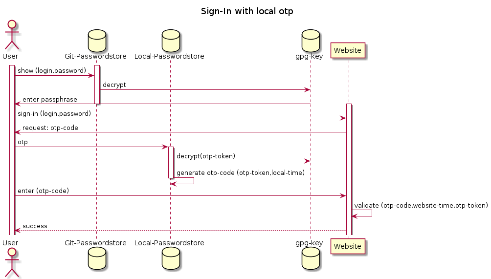

# Use case: Secure otp

## Summary
OTP is typically used to increase security of login process by using an additional factor. Depending on the threat-level, you can store OTP tokens separately from login and password.

## Normal secure setup
Most threats are mitigated by storing otp tokens in your "Git-Passwordstore" next to your login & password. An entry may look like:

```
gopass show git-passwordstore/website/yourLogin
```
Will result in

```
yourPassword
---
login: yourLogin
url: https://website.com
otpauth://totp/Website:yourLogin?secret=YourOtpTokenBase32Encoded&issuer=Website

```

You can generate your otp code with

```
gopass otp git-passwordstore/website

897402 lasts 17s 	|-------------=================|
```


## Advanced Secure Setup
For protection against exposed "Git-Passwordstores" you can use a "Local-Passwordstore" to store your otp-tokens. Entries may look like:

```
gopass show git-passwordstore/website/yourLogin
```

will result in 

```
yourPassword
---
login: yourLogin
url: https://website.com
```

```
gopass show local-passwordstore/website/yourOtp
```

will result in 


```
otpauth://totp/Website:yourLogin?secret=YourOtpTokenBase32Encoded&issuer=Website
```

You can generate your otp code with

```
gopass otp local-passwordstore/website/yourOtp

897402 lasts 17s 	|-------------=================|
```


## Threat analysis

### Assets & Dataflow


### Actors
* Shop-Hacker-Kid: Buys pawned credentials.
* Organised-Crime-Hacker: Uses phishing, may hack your git server.
* Customs-Officer-Hacker: Copies your hard drive, may ask for your facebook password.
* Intelligence-Hacker: Break in to your flat physically or hack your computer remote, may place a key logger.

### Threats

1. Shop-Hacker-Kid tests bought credentials for your account on "Website".
   1. Mitigated by using otp (both password store locations are secure enough).
2. Organised-Crime-Hacker phishes your "Website" login and password.
   1. Mitigated by using otp (both password store locations are secure enough).
3. Organised-Crime-Hacker hacks your git server and gets a clone of your Git-Passwordstore.
   1. Mitigated by using otp in your Git-Passwordstore as long as your gpg-key and passphrase is unexposed.
   2. Mitigated by using otp in your Local-Passwordstore.
4. Customs-Officer-Hacker copies your hard drive.
   1. Mitigated as long as your hard drive is encrypted
   2. Mitigated if your passphrase remains unexposed.
5. Intelligence-Hacker copies your hard drive, places a key logger and after some weeks reads all your keyboard inputs.
   1. Only a not exposed hardware otp token will mitigate this threat.
